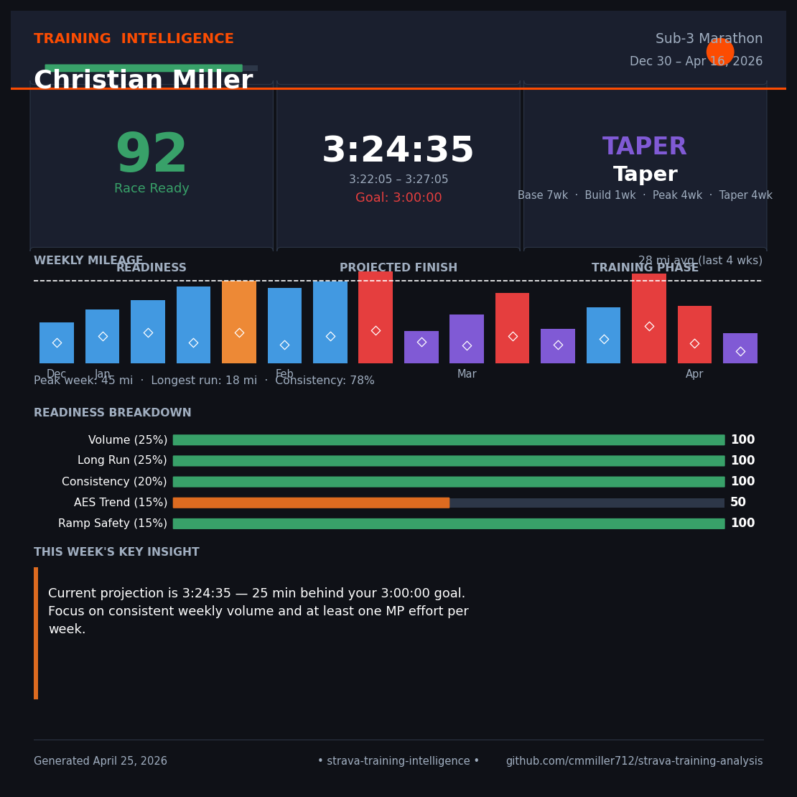

# Strava Training Intelligence

> **Strava tells you what you did. This tells you if it's working.**

A training intelligence system for serious endurance athletes.
Built on raw Strava export data — no API, no third-party subscriptions,
no black-box scores. Just your data, analyzed the way a coach would.



---

## The Problem

Strava is great at recording training. It is not good at interpreting it.
It will show you your pace, your heart rate, your weekly mileage. It will
not tell you whether your aerobic efficiency is improving, whether your
long run progression is on track, or whether your training load is building
faster than your body can absorb. For athletes training toward a specific
goal — a sub-3 marathon, a Boston qualifier, an Ironman — that
interpretation gap is where training plans succeed or fail.

I am a data engineer, two-time Ironman finisher, and 100k ultramarathon
runner currently targeting a sub-3 marathon. I built this system because
I wanted answers Strava could not give me. The result is a pipeline that
goes from raw .fit files and activities.csv to a full coaching intelligence
layer — phase detection, readiness scoring, aerobic efficiency trending,
intensity distribution analysis, and a weekly prescription — all
explainable, all configurable, all reproducible.

---

## What It Produces

#### Training Intelligence Dashboard

An interactive Streamlit dashboard with seven analytical sections:
weekly mileage by training phase, readiness score trajectory, aerobic
efficiency trend, readiness component breakdown, intensity distribution
analysis, next-week training prescription, and a coaching insights panel.
Every metric produces a plain-English recommendation — not a number, an action.
```bash
streamlit run app.py
```

#### Marathon Readiness Score (0–100)

A weighted composite of five signals — weekly volume, long run progression,
training consistency, aerobic efficiency trend, and ramp rate safety. Each
component is scored independently and combined with documented weights. The
model is fully explainable: you can see exactly why your score is 70, not
just that it is.

#### Projected Finish Time

Uses a Riegel-formula base adjusted by recent pace data and an AES fitness
modifier. Returns a predicted time with a confidence interval that widens
under fatigue or sparse data and narrows with consistent training. At 8
weeks into a build the model returned 3:48 ± 3 min against a sub-3 goal —
honest before it is flattering.

#### Training Intelligence Card

A single exportable PNG — 1080×1080, Instagram-native — summarizing the
full training picture: readiness score, projected finish, current phase,
weekly sparkline, component breakdown, and the week's highest-priority
coaching insight.
```bash
python generate_card.py --name "Your Name" --goal "Sub-3 Marathon" --goal-minutes 180
```

---

## How The Model Works

**Phase Detection**

Training phase is classified per week using five configurable thresholds:
base mileage ceiling, build mileage floor, peak long run distance, peak
marathon-pace specificity, and taper volume reduction factor. All thresholds
live in `src/config.py` and are overridable at runtime via the Streamlit
sidebar — a 4:30 marathoner and a sub-3 marathoner have fundamentally
different definitions of "peak." The classifier also maintains a calendar
scaffold across all weeks including rest weeks, so a mid-build cutback
week is correctly labeled Rest rather than mislabeled Taper.

**Readiness Model**

The readiness score is a weighted composite:
Volume (25%) + Long Run (25%) + Consistency (20%) +
AES Trend (15%) + Ramp Safety (15%) = Readiness Score

Each component scores 0–100 independently before weighting. Ramp rate
uses a miles-only fallback when heart rate data is absent, so the model
degrades gracefully rather than silently producing NaN. AES trend is
computed from a 30-calendar-day rolling window rather than 30 runs, which
normalizes for training density — a 30-run window covers 3 weeks during
heavy training and 3 months during recovery.

---

## Key Technical Decisions

| Decision | Why |
|---|---|
| FIT stream parsing for MP miles | Whole-activity average pace misclassifies easy runs with fast finishes. Second-by-second stream detection with `require_contiguous_miles` is significantly more accurate. |
| 30-calendar-day AES window | A 30-run rolling window is not time-consistent. Calendar days normalize across varying training density. |
| HR fallback for ramp rate | `load = miles × avg_hr` silently collapses to NaN when HR is missing, breaking the ramp signal. Volume-only fallback keeps the metric live. |
| `cfg` as `SimpleNamespace` | The same phase and readiness functions serve both the headless pipeline (config module) and the Streamlit dashboard (SimpleNamespace built from slider values) without branching logic. |
| Calendar scaffold for rest weeks | `groupby("week_start")` drops weeks with no runs. Without a scaffold, rest weeks disappear from consistency scoring and taper detection fires incorrectly. |

---

## Getting Your Strava Data

This system runs entirely on your own Strava export — no API key
or third-party access required. To download your data:

1. Log in to Strava on a desktop browser
2. Go to **Settings → My Account → Download or Delete Your Account**
3. Click **Request Your Archive**
4. Strava will email you a ZIP file — this can take a few minutes
   to a few hours depending on your activity history
5. Unzip the archive and confirm it contains:
   - `activities.csv` — your full activity list
   - `activities/` — a folder of individual `.fit` files
     (one per activity — these contain second-by-second
     heart rate, pace, and GPS streams)
6. Place the unzipped contents at `data/raw/strava_export/`
   so the path looks like:
   `data/raw/strava_export/activities.csv`
   `data/raw/strava_export/activities/`

The pipeline uses both. `activities.csv` powers all volume and
pace metrics. The `.fit` files power marathon-pace stream
detection and aerobic efficiency scoring — the more `.fit` files
present, the more accurate the readiness model becomes.

> **Privacy note:** Your export contains GPS coordinates and
> personal data. The `data/` directory is git-ignored by default.
> Never commit your raw export.

---

## Running It
```bash
# 1. Place your Strava export in data/raw/strava_export/
#    (activities.csv + activities/*.fit files)

# 2. Build the datasets
python src/build_datasets.py

# 3. Launch the dashboard
streamlit run app.py

# 4. Generate the shareable card
python generate_card.py
```

All thresholds — goal pace, mileage targets, phase boundaries — are
configured in `src/config.py` and overridable at runtime via the
dashboard sidebar.
```bash
pip install -r requirements.txt
```

---

## About

Built by Christian Miller — data engineer, 2× Ironman, 100k ultramarathon
finisher, and sub-3 marathon candidate. This project exists because I
wanted coaching intelligence from my own data, and because I think Strava
could build something like this natively.

→ [LinkedIn](https://www.linkedin.com/in/christian-miller-27957914a/) · [Strava](https://www.strava.com/athletes/122046015)

---

## Privacy

Raw Strava export data is not committed. GPS coordinates, route data, and
personally identifiable fields are excluded from all published outputs.
